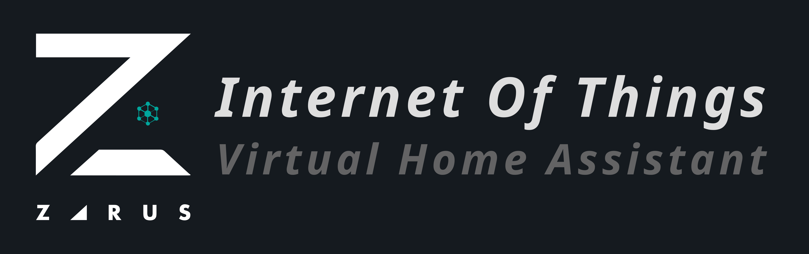

[](https://creativecommons.org/licenses/by-nc-sa/4.0/deed.es)



# Virtual Home Aassistant
Virtual Home assistant is a home assistant designed to improve the user experience in their home through intelligent management of IoT devices and task automation.

&nbsp;

## Manual Installation
- Clone this repository on your computer.
- Install the required packages
    ```
    pip install -r requirements.txt
    ```
- Create a configuration.json file in the data folder of the project and configure the devices and services you want to integrate with Home Assistant. Be sure to follow the configuration_template.json format.
- Run the assistant.py file to start the assistant.

## Docker Usage
- Build Docker image: 
    ```
    docker build --tag gptassistant-image .
    ```
- Run Docker image:
    ```
    docker run -d \
    --restart unless-stopped \
    --name gptassistant \
    -e TZ=America/Costa_Rica \
    --network host \
    gptassistant-image
    ```
&nbsp;

## File Configuration

### MQTT Configuration
#
The MQTT section contains the configuration for the MQTT broker that the assistant uses to subscribe and publish messages. The following parameters need to be set:

* `brokerAddress`: The address of the MQTT broker.
* `mqttUser`: The username to authenticate with the MQTT broker.
* `mqttPass`: The password to authenticate with the MQTT broker.
* `subscriptionTopics`: An array of objects representing the topics the assistant should subscribe to. Each object contains two fields:
    * `commandName`: A string representing the name of the command associated with the topic.
    * `topic`: A string representing the topic to subscribe to.


### OpenAI Configuration
#

The OpenAI section contains the configuration for the OpenAI API. The following parameters need to be set:

* `apiKey`: The API key for the OpenAI API.
* `model`: The name of the OpenAI model to use.
* `maxTokensPerRequestsSended`: The maximum number of tokens to send per request to the OpenAI API.
* `maxTokensPerRequestsRecieved`: The maximum number of tokens to receive per request from the OpenAI API.
* `maxTokensPerDay`: The maximum number of tokens the assistant can use per day.
* `usedCharsFilename`: The name of the file where the assistant will store the number of used tokens.
* `initialConversation`: An array of objects representing the initial conversation between the user and the assistant. Each object contains two fields:
    * `role`: A string representing the role of the speaker (either "system", "user", or "assistant").
    * `content`: A string representing the message spoken by the speaker.

### Home Assistant Configuration
#
The Home Assistant section contains the configuration for the Home Assistant API. The following parameters need to be set:

* `url`: The URL of the Home Assistant API.
* `haToken`: The long-lived access token to authenticate with the Home Assistant API.
* `people`: An array of objects representing the people who live in the house. Each object contains two fields:
    * `name`: A string representing the name of the person.
    * `id`: A string representing the ID of the person in Home Assistant.
* `calendars`: An array of objects representing the calendars in Home Assistant. Each object contains two fields:
    * `owner`: A string representing the owner of the calendar.
    * `id`: A string representing the ID of the calendar in Home Assistant.
* `binarySensors`: An array of objects representing the binary sensors in Home Assistant. Each object contains four fields:
    * `name`: A string representing the name of the binary sensor.
    * `id`: A string representing the ID of the binary sensor in Home Assistant.
    * `offValue`: A string representing the state of the binary sensor when it's off.
    * `onValue`: A string representing the state of the binary sensor when it's on.
* `sensors`: An array of objects representing the sensors in Home Assistant. Each object contains three fields:
    * `name`: A string representing the name of the sensor.
    * `id`: A string representing the ID of the sensor in Home Assistant.
    * `ignoringStates`: An array of strings representing the states of the sensor to ignore.
* `generalDevices`: An array of objects representing the general devices in Home Assistant. Each object contains three fields:
    * `name`: A string representing the name of the device.
    * `id`: A string representing the ID of the device in Home Assistant.
    * `ignoringStates`: An array of strings representing the states of the device to ignore.
    
&nbsp;

---
## Features

* Control of IoT devices through HomeAssistant and MQTT.
* Generation of natural language responses through a GPT-3-turbo model.
* Generation of audio files through the Google Cloud TTS API.
* Playback of audio files on home speakers using the [SpeakerManager](https://github.com/AndresDuran53/speaker-manager) program.
---
## License
Zarus IoT Controller is an open source code. All files are licenced under Creative Commons [Reconocimiento-NoComercial-CompartirIgual 4.0 Internacional](https://creativecommons.org/licenses/by-nc-sa/4.0/deed.es)